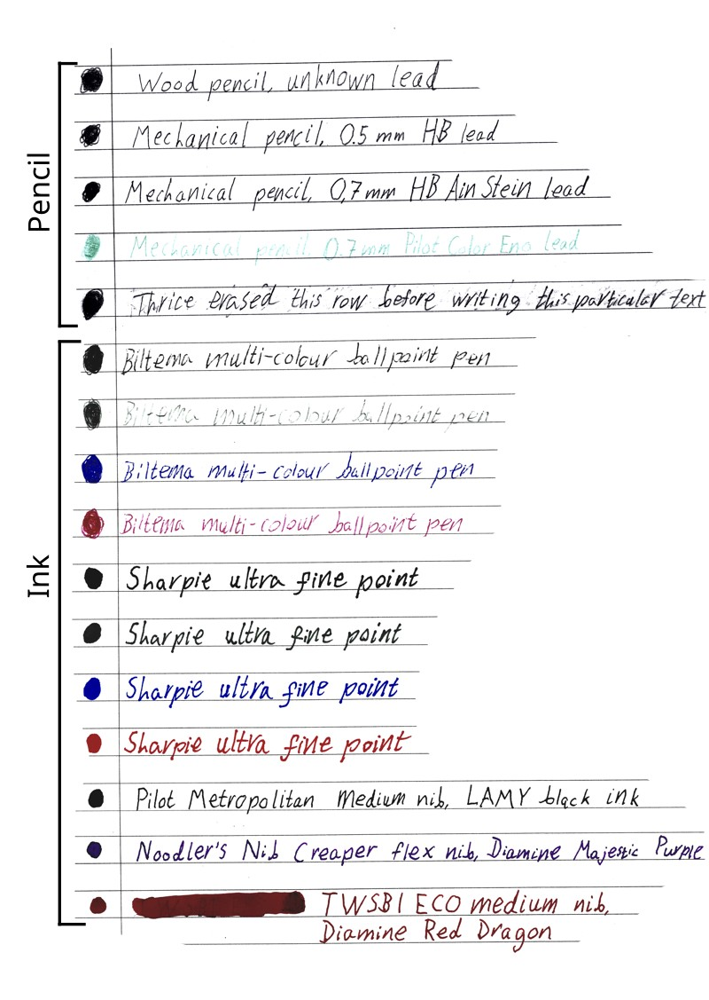

Krita plugin for cleaning up scanned paper notes. There's an action variant for
notes written with a pencil (graphite) and one for notes written with a pen
(ink).

This plugin was written in a day to integrate my paper notes into my Obsidian
vault. It is only tested on Linux, and only as far as "it works on my machine."
Please exercise caution and back-up your files before you can verify that you
are able to get a workflow with this plugin working.

# Comparison

# Installation

1. Copy the contents of this project's `krita` folder into your `krita` folder.
   On Linux, this is usually `$HOME/.local/share/krita/`. You can find the
folder by pressing `Settings` -> `Manage resources...` -> `Open Resource
Folder`.

2. Go to `Settings` -> `Configure Krita...` -> `Python Plugin Manager` and
   check the box for `Clean paper notes` to enable the plugin.

You can also install the files using GNU Stow as done in the included
`install.sh` and `uninstall.sh` scripts.

# Usage

1. The action cannot be undone so I recommend keeping your originals backed up
   and saving a processed copy instead of overwriting the original.

2. Before running the actions, clean up your image by cropping as close to the
   content area as possible and draw white over any elements you want to
remove.

3. Select the appropriate action under `Tools` -> `Scripts` -> `Clean paper
   notes`. The action designed for pencil will darken the text a lot more than
the one for ink, while the one for ink has some adjustments to retain colour.

4. To crop your picture afterwards, press `Select` -> `Select Opaque` ->
   `Select Opaque (Replace)` followed by `Image` -> `Trim to Selection`.

5. Export a copy of your image.

# How it works

The plugin works by first altering levels to pull white closer to true white
and the darkest colours towards black. It then converts white to alpha, and
finally adjusts alpha so that all pixels below a certain opacity threshold are
made fully transparent. In the ink version, this step also restores some
brightness to colours.

# Possible future improvements

There's room for improvement in this project, though it is admittedly unlikely
that I make them as this project is a big ol' yak shave.

## Batch processing

Batch processing should be doable, but was skipped due to trouble getting set
active document to actually work.

## Automatic cropping

Cropping is currently quite easy to do by just selecting opaque and cropping to
selection. Unfortunately this has problems with race conditions and is quite
unpredictable overall when automated.

## Customisable filters

The project in its current iteration is written based on what I thought looked
given the paper, pencils, inks, and scanner I used. This is almost definitely
not something universal.
